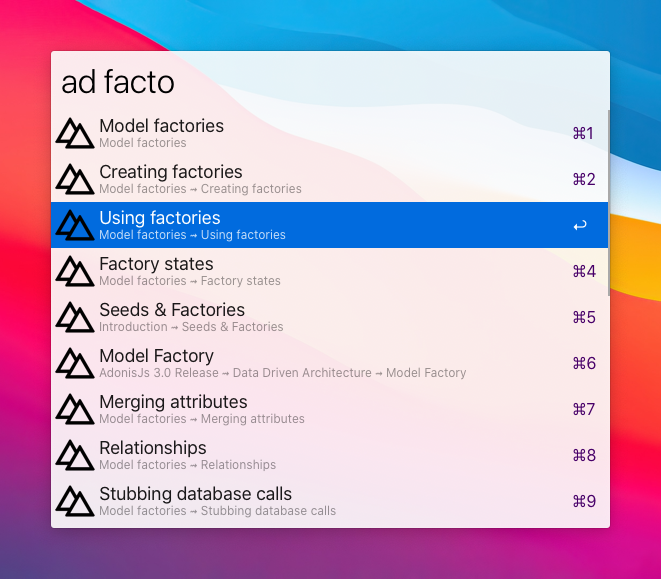

# [Adonis Docs](https://preview.adonisjs.com/guides/quick-start) Workflow for Alfred

Adonis docs search workflow for Alfred.



## Installation

1. [Download the latest AdonisDocs.alfredworkflow version](https://github.com/ashokgelal/adonis-docs-alfred/releases/latest)
2. Double-click the `.alfredworkflow` file to install it.
3. Add the workflow to a category, then click `Import`.

## Usage

Type `ad` followed by a search term to see the result. While selected, hit `⌘+y` for quickly viewing the documentation of the selected search result or hit enter to browse it online.

```
ad <query>
```


